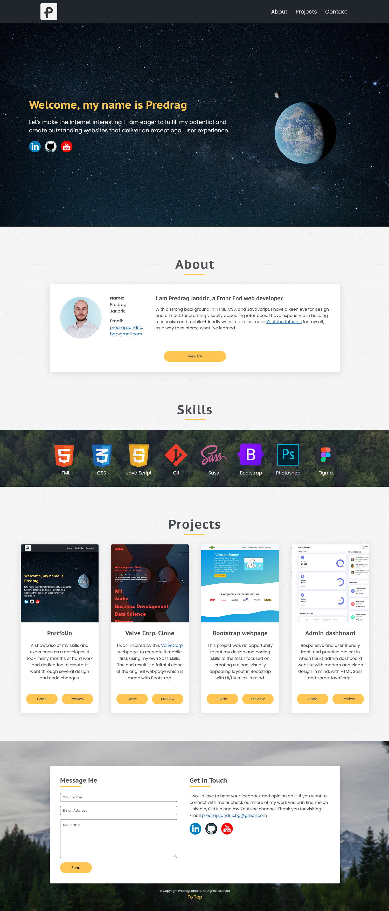

# 🛠 Portfolio

# 🔗 [Live Preview](https://www.predrag-jandric.com/)

## Welcome! 👋

Thanks for checking out my practice project.

- This is one among many of my JS learning projects

Features (order: top to bottom)

Navbar: For navigating the page with anchor points

Header: Welcome page that takes 90% view port height upon loading, it has my name and links for youtube, linkedin and github. On the right side there are elements (earth, moon and comet) that react on mouse-move events

About: More info about who am I containing a picture and a link to my CV

Skills: Tools and languages that I know how to use

Projects: A section containing 4 of my best projects that I want to feature

Languages 👨‍💻

JS: functions, DOM manipulation, conditional statements, forEach methods, mouse events.
Sass: mixins, modules, nesting, partials, media queries, variables

Thanks for checking out my Portfolio.